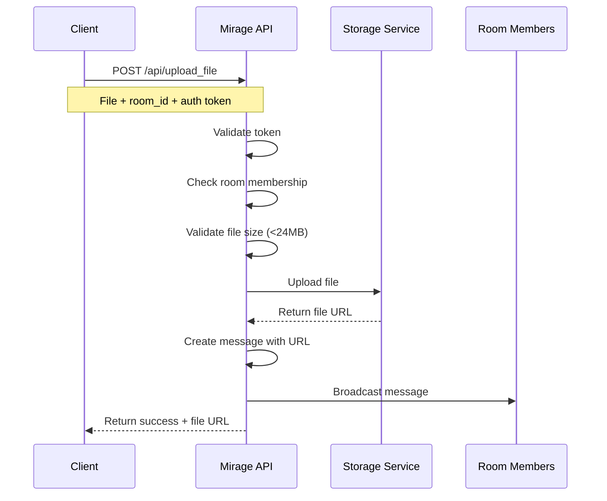

## Overview

Mirage allows you to upload and share files within chat rooms. Files are uploaded to an external storage service and shared as URLs in room messages.

<Warning>
  File uploads have a **24MB maximum size limit**. Files exceeding this limit will be rejected.
</Warning>

## File Upload Process

Files are uploaded through a dedicated endpoint and automatically posted as messages in the target room.

<Steps>
  <Step title="Prepare your file and authentication">
    You'll need:
    - Your authentication token
    - The file to upload
    - The target room ID

    ```python
    import requests

    headers = {
        'Authorization': 'your_auth_token'
    }
    ```

    <Note>
      Unlike other endpoints, file uploads don't use `Content-Type: application/json` because they use multipart form data.
    </Note>
  </Step>

  <Step title="Send file upload request">
    Upload the file using a POST request to `/api/upload_file`.

    ```python
    # Open file in binary mode
    with open('document.pdf', 'rb') as file:
        response = requests.post(
            'https://api.mirage.com/api/upload_file',
            headers=headers,
            files={'file': file},
            data={'room_id': '42'}
        )
    ```
  </Step>

  <Step title="Handle the response">
    On success, you'll receive the file URL.

    ```json
    {
        "message": "File uploaded successfully",
        "file_url": "https://cpp-webserver.onrender.com/files/abc123.pdf"
    }
    ```

    The file URL is automatically posted as a message in the specified room.
  </Step>
</Steps>

## File Size Limit

The **24MB limit** is enforced server-side to prevent resource exhaustion.

```python
# From app/routes/upload.py:31-32
if file.content_length > 24 * 1024 * 1024:
    return jsonify({'error': 'File size exceeds the 24MB limit'}), 400
```

<Tip>
  **24MB = 25,165,824 bytes**. Check your file size before uploading to avoid errors.
</Tip>

### Calculating File Size

```python
import os

file_path = 'large_document.pdf'
file_size = os.path.getsize(file_path)
file_size_mb = file_size / (1024 * 1024)

if file_size_mb > 24:
    print(f"File too large: {file_size_mb:.2f} MB")
else:
    print(f"File size OK: {file_size_mb:.2f} MB")
```

## Upload Service Configuration

Files are uploaded to an external service configured in `app/config.py:9`:

```python
UPLOAD_URL = 'https://cpp-webserver.onrender.com/upload'
```

### Upload Implementation

The upload process uses the requests library to forward files to the storage service:

```python
# From app/utils.py:18-32
def file_uploader(file):
    try:
        file.stream.seek(0)
        headers = {
            'User-Agent': 'Mozilla/5.0',
            'Content-Type': 'application/octet-stream'
        }

        response = requests.post(
            UPLOAD_URL,
            data=file.stream,
            headers=headers
        )
        response.raise_for_status()
        return response.text.strip()  # Returns URL or file ID
```

<Accordion title="Error Handling">
  The file uploader handles multiple error scenarios:

  ```python
  # From app/utils.py:34-41
  except requests.exceptions.HTTPError as http_err:
      raise Exception(f'HTTP Error: {http_err.response.status_code}')
  except requests.exceptions.ConnectionError:
      raise Exception('Connection error: Could not connect to upload service.')
  except requests.exceptions.Timeout:
      raise Exception('Timeout error: Upload request took too long.')
  except Exception as err:
      raise Exception(f'Unexpected error during file upload: {str(err)}')
  ```
</Accordion>

## Room Membership Requirement

You **must be a member** of the target room to upload files.

```python
# From app/routes/upload.py:53-56
c.execute('SELECT id FROM room_members WHERE room_id=? AND username=?', 
          (room_id, username))
if not c.fetchone():
    return jsonify({'error': 'You are not a member of this room'}), 403
```

<Warning>
  Attempting to upload files to rooms you haven't joined will result in a `403 Forbidden` error.
</Warning>

## File URLs as Messages

When a file is successfully uploaded, its URL is automatically posted as a message in the room.

```python
# From app/routes/upload.py:60-66
message_data = {
    'username': username,
    'message': f'{file_url}',  # File URL is the message content
    'created_at': time.time(),
    'room_id': room_id
}
messages.append(message_data)
```

### Message Lifecycle

File URLs follow the same lifecycle as regular messages:

- Subject to 30-minute expiration (`MESSAGE_LIFESPAN`)
- Count toward the 100-message limit (`MAX_MESSAGES`)
- Removed when room reaches capacity

<Note>
  While the message containing the file URL expires, the file itself remains on the storage service. Save important file URLs externally if needed.
</Note>

## Supported File Types

Mirage uses `Content-Type: application/octet-stream` for uploads, making it **file-type agnostic**.

<CardGroup cols={2}>
  <Card title="Documents" icon="file-lines">
    PDF, DOC, DOCX, TXT, MD
  </Card>
  
  <Card title="Images" icon="image">
    PNG, JPG, JPEG, GIF, SVG, WEBP
  </Card>
  
  <Card title="Archives" icon="file-zipper">
    ZIP, TAR, GZ, RAR, 7Z
  </Card>
  
  <Card title="Media" icon="video">
    MP4, MP3, WAV, AVI, MOV
  </Card>
</CardGroup>

<Tip>
  No file type restrictions are enforced at the application level, but always stay within the 24MB size limit.
</Tip>

## Error Handling

### Common Upload Errors

| Status Code | Error | Description | Solution |
|-------------|-------|-------------|----------|
| `400` | No file provided | File missing from request | Include file in request |
| `400` | No file name provided | File has empty filename | Provide valid filename |
| `400` | No room ID provided | Missing `room_id` parameter | Include room ID in form data |
| `400` | File size exceeds 24MB limit | File too large | Reduce file size or split file |
| `401` | Invalid token or token missing | Auth token invalid | Provide valid auth token |
| `401` | Unauthorized access | Token doesn't match a user | Re-authenticate |
| `403` | Not a member of this room | User not in target room | Join room first |
| `500` | File upload failed | External service error | Retry or contact support |

### Handling Upload Failures

Implement retry logic for transient failures:

```python
import time

def upload_with_retry(file_path, room_id, headers, max_retries=3):
    for attempt in range(max_retries):
        try:
            with open(file_path, 'rb') as file:
                response = requests.post(
                    'https://api.mirage.com/api/upload_file',
                    headers=headers,
                    files={'file': file},
                    data={'room_id': room_id}
                )
                response.raise_for_status()
                return response.json()
        except requests.exceptions.RequestException as e:
            if attempt == max_retries - 1:
                raise
            print(f"Attempt {attempt + 1} failed: {e}. Retrying...")
            time.sleep(2 ** attempt)  # Exponential backoff
```

## Complete Upload Example

Here's a full example with error handling:

```python
import requests
import os

def upload_file_to_room(file_path, room_id, auth_token):
    # Validate file exists
    if not os.path.exists(file_path):
        raise FileNotFoundError(f"File not found: {file_path}")
    
    # Check file size
    file_size = os.path.getsize(file_path)
    max_size = 24 * 1024 * 1024  # 24MB in bytes
    
    if file_size > max_size:
        raise ValueError(
            f"File too large: {file_size / (1024*1024):.2f}MB. "
            f"Maximum: 24MB"
        )
    
    # Prepare request
    headers = {'Authorization': auth_token}
    
    # Upload file
    with open(file_path, 'rb') as file:
        response = requests.post(
            'https://api.mirage.com/api/upload_file',
            headers=headers,
            files={'file': (os.path.basename(file_path), file)},
            data={'room_id': str(room_id)}
        )
    
    # Handle response
    if response.status_code == 200:
        data = response.json()
        print(f"Upload successful: {data['file_url']}")
        return data['file_url']
    else:
        error = response.json().get('error', 'Unknown error')
        raise Exception(f"Upload failed ({response.status_code}): {error}")

# Usage
try:
    file_url = upload_file_to_room(
        file_path='report.pdf',
        room_id=42,
        auth_token='your_auth_token'
    )
    print(f"File available at: {file_url}")
except Exception as e:
    print(f"Error: {e}")
```

## Upload Flow Diagram



## Server Ping Mechanism

When uploading files, Mirage pings the external storage service to keep it awake:

```python
# From app/routes/chat.py:128-129
ping_thread = threading.Thread(target=ping_server, args=(60,), daemon=True)
ping_thread.start()

# Ping implementation from app/utils.py:43-50
def ping_server(interval=60):
    while True:
        try:
            res = requests.get('https://cpp-webserver.onrender.com', timeout=5)
            print(f'Ping: {res.status_code} - {res.reason}')
        except Exception as e:
            print(f'Ping failed: {e}')
        time.sleep(interval)
```

<Note>
  This background thread prevents the external service from going to sleep during upload operations.
</Note>

## Best Practices

<AccordionGroup>
  <Accordion title="Compress files before uploading">
    Stay well under the 24MB limit by compressing files when possible. Use ZIP for multiple files or compress images/videos.
  </Accordion>

  <Accordion title="Use descriptive filenames">
    Clear filenames help other room members understand what they're downloading.
  </Accordion>

  <Accordion title="Validate files client-side">
    Check file size before uploading to provide immediate feedback to users.
  </Accordion>

  <Accordion title="Save important file URLs">
    Since messages expire after 30 minutes, save file URLs externally if you need long-term access.
  </Accordion>

  <Accordion title="Handle upload errors gracefully">
    Network issues can occur. Implement retry logic and provide clear error messages to users.
  </Accordion>

  <Accordion title="Consider bandwidth">
    Large files take time to upload. Provide progress indicators for better UX.
  </Accordion>
</AccordionGroup>

## Security Considerations

<CardGroup cols={2}>
  <Card title="Token Security" icon="key">
    Never expose your auth token in client-side code or logs. Always use secure server-side uploads.
  </Card>
  
  <Card title="File Validation" icon="shield-check">
    While Mirage doesn't restrict file types, implement your own validation for security.
  </Card>
  
  <Card title="Virus Scanning" icon="virus-slash">
    Consider scanning files for malware before upload if dealing with untrusted sources.
  </Card>
  
  <Card title="Access Control" icon="lock">
    Room membership verification ensures only authorized users can upload files.
  </Card>
</CardGroup>

## Troubleshooting

<AccordionGroup>
  <Accordion title="Upload times out">
    Large files or slow connections can cause timeouts. Try:
    - Compressing the file
    - Using a faster internet connection
    - Increasing timeout values in your HTTP client
    - Splitting large files into smaller chunks
  </Accordion>

  <Accordion title="File URL not appearing in messages">
    If the upload succeeds but you don't see the message:
    - Check room membership status
    - Verify you're listening to the correct room ID
    - Ensure messages haven't expired (30-minute limit)
    - Check if room has exceeded 100 message limit
  </Accordion>

  <Accordion title="External storage service unreachable">
    The storage service (`cpp-webserver.onrender.com`) may occasionally be down:
    - Wait a few minutes and retry
    - Check service status if available
    - Contact administrator if issue persists
  </Accordion>

  <Accordion title="File size error despite being under 24MB">
    Some clients report `Content-Length` differently:
    - Ensure you're measuring raw file size, not encoded size
    - Check for multipart form encoding overhead
    - Try uploading a slightly smaller file to test
  </Accordion>
</AccordionGroup>

## Alternative: Direct Storage Service Upload

For advanced use cases, you could potentially upload directly to the storage service:

```python
import requests

def direct_upload(file_path):
    with open(file_path, 'rb') as f:
        response = requests.post(
            'https://cpp-webserver.onrender.com/upload',
            data=f.read(),
            headers={
                'User-Agent': 'Mozilla/5.0',
                'Content-Type': 'application/octet-stream'
            }
        )
    return response.text.strip()
```

<Warning>
  Direct uploads bypass Mirage's authentication and room membership checks. This approach is not recommended unless you have specific requirements.
</Warning>

## Next Steps

<CardGroup cols={2}>
  <Card title="Creating Rooms" icon="comments" href="/guides/creating-rooms">
    Learn how to create rooms for file sharing
  </Card>
  
  <Card title="Content Moderation" icon="shield-check" href="/guides/content-moderation">
    Understand content safety features
  </Card>
</CardGroup>